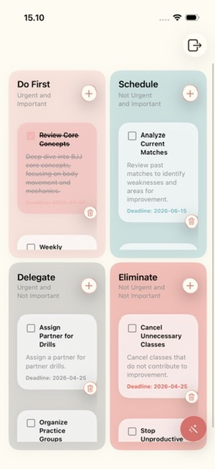
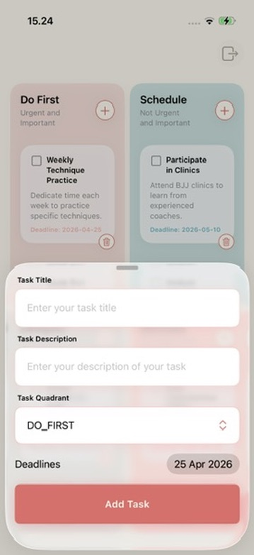
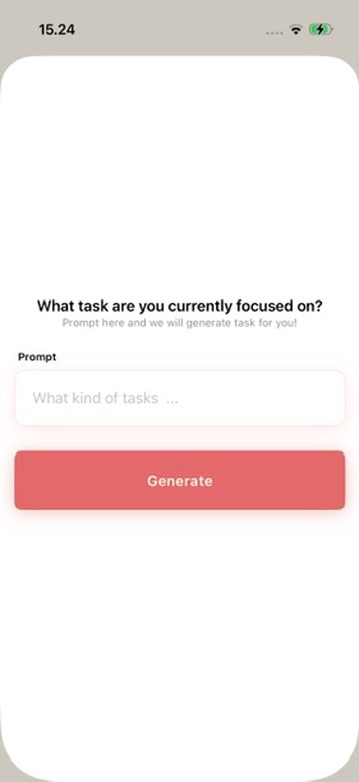
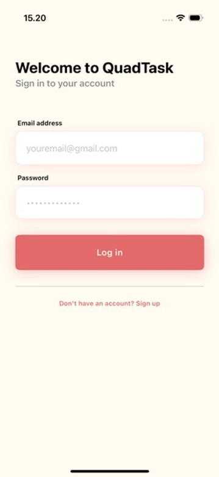
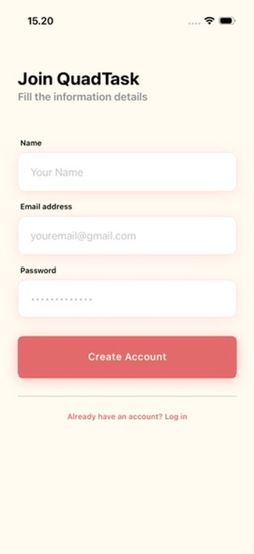
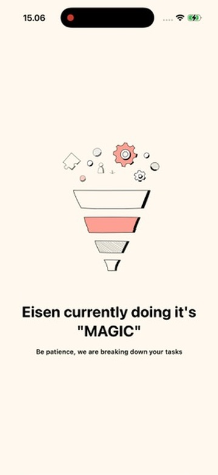

# QuadTask
 
QuadTask is a productivity app that brings the Eisenhower Matrix concept into a daily live planner, helping users understand what they've missed when determining priority so the right tasks get done at the right time.
 
---
 
## Features
 
- **Authentication** — Secure login and registration to keep your tasks personal and synced.
- **AI Task Generation** — Describe your goal and Apple Intelligence automatically breaks it down into tasks distributed across all four quadrants.
- **Drag & Drop** — Rearrange tasks between quadrants with a natural drag gesture. Change priority on the fly.
- **Task Management** — Create, read, update, and delete tasks across all quadrants. Each task includes a title, description, deadline, and quadrant assignment.
---

## Screenshots
 
| Home | Add Task | Generate Plan |
|:----:|:--------:|:-----------:|
|  |  |  |

| Login | Register | AI Generate Process |
|:----:|:--------:|:--------:|
|  |  |  |

## Demo

## Tech Stack
 
- **SwiftUI** — UI framework
- **Foundation Models** — On-device Apple Intelligence for AI task generation
- **REST API** — Backend integration for auth and task persistence
- **Lottie** - UI Animation library
- **AlertToast** - UI Alerting component
---
 
## Eisenhower Matrix
 
| | Urgent | Not Urgent |
|---|---|---|
| **Important** | DO FIRST | SCHEDULE |
| **Not Important** | DELEGATE | ELIMINATE |